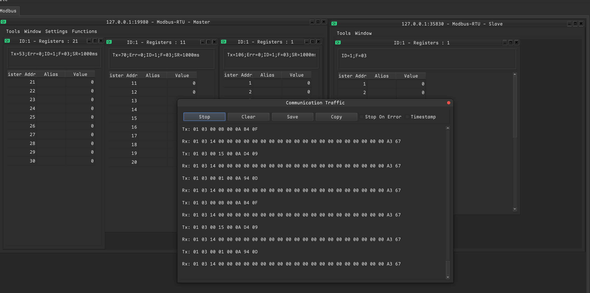
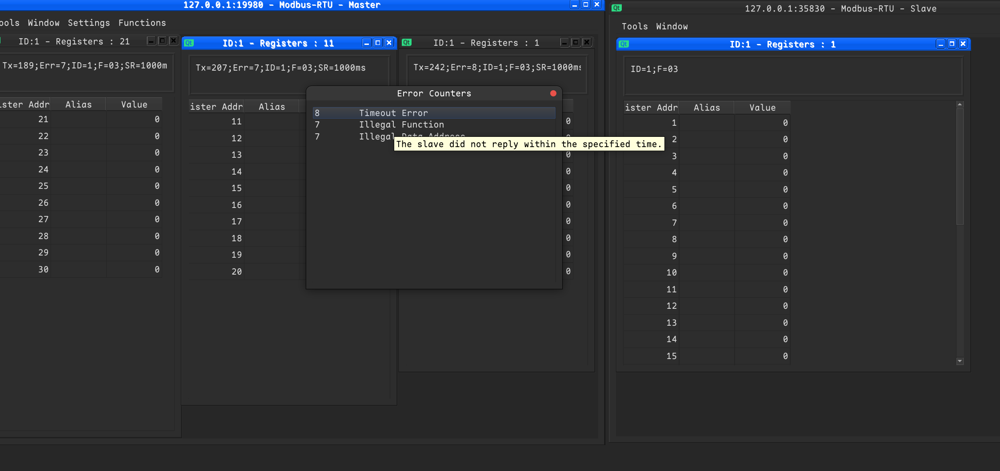

# DebugMyProtocol
 
**A Modbus communication protocol debugging tool (Modbus poll, Modbus slave likely),support multi-master and multi-slave online at the same time.**
 
## Supported connection types:
 
*Serial Port*
 
*TCP Server*
 
*TCP Client*
 
*UDP*
 
 
## Supported protocols:
 
*Modbus RTU*
 
*Modbus RTU over TCP/IP*
 
*Modbus RTU over UDP/IP*
 
*Modbus ASCII*
 
*Modbus ASCII over TCP/IP*
 
*Modbus ASCII over UDP/IP*
 
*Modbus TCP/IP*
 
*Modbus UDP/IP*
 
 
## Supported Modbus Function Codes:
 
**Master:**
 
*01 Read Coils*
 
*02 Read Descrete Inputs*
 
*03 Read Holding Registers*
 
*04 Read Input Registers*
 
*05 Write Single Coil*
 
*06 Write Single Register*
 
*15 Write Multiple Coils*
 
*16 Write Multiple Registers*
 
 
**Slave:**
 
*01 Coil Status*
 
*02 Input Status*
 
*03 Holding Registers*
 
*04 Input Registers*
 
 
## support multiple data formats:
 
*Coil*
 
*Signed*
 
*Unsigned*
 
*Hex*
 
*ASCII HEX*
 
*Binary*
 
*32 Bit Signed Big-endian*
 
*32 Bit Signed Little-endian*
 
*32 Bit Signed Big-endian byte swap*
 
*32 Bit Signed Little-endian byte swap*
 
*32 Bit Unsigned Big-endian*
 
*32 Bit Unsigned Little-endian*
 
*32 Bit Unsigned Big-endian byte swap*
 
*32 Bit Unsigned Little-endian byte swap*
 
*64 Bit Signed Big-endian*
 
*64 Bit Signed Little-endian*
 
*64 Bit Signed Big-endian byte swap*
 
*64 Bit Signed Little-endian byte swap*
 
*64 Bit Unsigned Big-endian*
 
*64 Bit Unsigned Little-endian*
 
*64 Bit Unsigned Big-endian byte swap*
 
*64 Bit Unsigned Little-endian byte swap*
 
*32 Bit Float Big-endian*
 
*32 Bit Float Little-endian*
 
*32 Bit Float Big-endian byte swap*
 
*32 Bit Float Little-endian byte swap*
 
*64 Bit Float Big-endian*
 
*64 Bit Float Little-endian*
 
*64 Bit Float Big-endian byte swap*
 
*64 Bit Float Little-endian byte swap*
 
 
## Support display the communication traffic:
 

 
 
## Support error counters:
 

 
 
